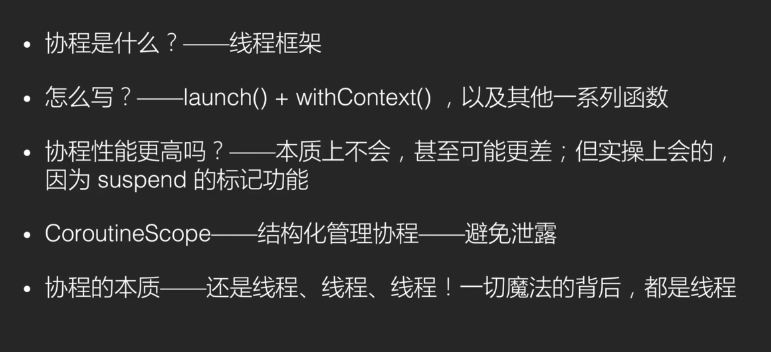

协程

```kotlin
val scope: CoroutineScope = MainScope();

scope.launch(Dispatchers.Main) {
    ioCode1()
    ioCode2()
}
uiCode1()

2020-12-03 00:09:12.593 7202-7202/com.anshon.kotlinlang I/System.out: uiCode1 main
2020-12-03 00:09:13.710 7202-7255/com.anshon.kotlinlang I/System.out: ioCode1 DefaultDispatcher-worker-1
2020-12-03 00:09:16.753 7202-7255/com.anshon.kotlinlang I/System.out: ioCode2 DefaultDispatcher-worker-1
-------------------------------------------
scope.launch(Dispatchers.Main) {
    coroutineScope {
        launch { ioCode2() }
        launch { ioCode1() }
    }
    uiCode1()
    uiCode2()
}

2020-12-03 00:01:44.620 7006-7082/com.anshon.kotlinlang I/System.out: ioCode1 DefaultDispatcher-worker-3
2020-12-03 00:01:46.624 7006-7079/com.anshon.kotlinlang I/System.out: ioCode2 DefaultDispatcher-worker-1
2020-12-03 00:01:46.625 7006-7006/com.anshon.kotlinlang I/System.out: uiCode1 main
2020-12-03 00:01:46.625 7006-7006/com.anshon.kotlinlang I/System.out: uiCode2 main
-------------------------------------------
scope.launch(Dispatchers.Main) {
    println("code launch  ${Thread.currentThread().name}")
    val one = async { ioCode1() }
    val two = async { ioCode2() }
    val same = (one.await() == two.await())
    println("code one == two:$same")
}

2020-12-03 00:15:21.952 7445-7445/com.anshon.kotlinlang I/System.out: code launch  main
2020-12-03 00:15:23.074 7445-7496/com.anshon.kotlinlang I/System.out: ioCode1 DefaultDispatcher-worker-1
2020-12-03 00:15:25.074 7445-7498/com.anshon.kotlinlang I/System.out: ioCode2 DefaultDispatcher-worker-3
2020-12-03 00:15:25.075 7445-7445/com.anshon.kotlinlang I/System.out: code one == two:true

-------------------------------------------
suspend fun ioCode1() {
    withContext(Dispatchers.IO) {
        Thread.sleep(1000)
        println("ioCode1 ${Thread.currentThread().name}")
    }
}

suspend fun ioCode2() {
    withContext(Dispatchers.IO) {
        Thread.sleep(3000)
        println("ioCode2 ${Thread.currentThread().name}")
    }
}

fun uiCode1() {
    println("uiCode1 ${Thread.currentThread().name}")
}

fun uiCode2() {
    println("uiCode2 ${Thread.currentThread().name}")
}

//避免协程泄露
override fun onDestroy() {
    super.onDestroy()
    scope.cancel()  //或者launch时使用   lifecycleScope.launch{}
}

```


```kotlin
//线程并行

scope.launch(Dispatchers.Main) {

            coroutineScope {// 协程环境块，当前块执行完毕再切到其他协程
                async(Dispatchers.IO) { ioCode1() }
                async(Dispatchers.IO) { ioCode2() }
            }
//            val one = async(Dispatchers.IO) { ioCode1() }
//            val two = async(Dispatchers.IO) { ioCode2() }
//            one.await()
//            two.await()
            uiCode1()
            uiCode2()
        }
        
    suspend fun ioCode1() {
        Log.e(TAG, "ioCode1: " + Thread.currentThread().name)
        for (i in 0 until 10) {
            Log.e(Companion.TAG, "ioCode1: $i")
            delay(10)
        }
    }

    suspend fun ioCode2() {
        Log.e(TAG, "ioCode2: " + Thread.currentThread().name)
        for (i in 0 until 5) {
            Log.e(Companion.TAG, "ioCode2: $i")
            delay(10)
        }
    }

    fun uiCode1() {
        Log.e(Companion.TAG, "uiCode1: " + Thread.currentThread().name)
    }

    fun uiCode2() {
        Log.e(Companion.TAG, "uiCode2: " + Thread.currentThread().name)
    }
    

2021-03-01 17:07:29.799 14712-14753/com.anshon.myapplication E/MainActivity: ioCode1: DefaultDispatcher-worker-1
2021-03-01 17:07:29.799 14712-14753/com.anshon.myapplication E/MainActivity: ioCode1: 0
2021-03-01 17:07:29.800 14712-14755/com.anshon.myapplication E/MainActivity: ioCode2: DefaultDispatcher-worker-3
2021-03-01 17:07:29.800 14712-14755/com.anshon.myapplication E/MainActivity: ioCode2: 0
2021-03-01 17:07:29.816 14712-14755/com.anshon.myapplication E/MainActivity: ioCode1: 1
2021-03-01 17:07:29.817 14712-14754/com.anshon.myapplication E/MainActivity: ioCode2: 1
2021-03-01 17:07:29.827 14712-14757/com.anshon.myapplication E/MainActivity: ioCode1: 2
2021-03-01 17:07:29.827 14712-14754/com.anshon.myapplication E/MainActivity: ioCode2: 2
2021-03-01 17:07:29.838 14712-14757/com.anshon.myapplication E/MainActivity: ioCode2: 3
2021-03-01 17:07:29.838 14712-14754/com.anshon.myapplication E/MainActivity: ioCode1: 3
2021-03-01 17:07:29.849 14712-14757/com.anshon.myapplication E/MainActivity: ioCode1: 4
2021-03-01 17:07:29.849 14712-14754/com.anshon.myapplication E/MainActivity: ioCode2: 4
2021-03-01 17:07:29.861 14712-14757/com.anshon.myapplication E/MainActivity: ioCode1: 5
2021-03-01 17:07:29.872 14712-14757/com.anshon.myapplication E/MainActivity: ioCode1: 6
2021-03-01 17:07:29.882 14712-14757/com.anshon.myapplication E/MainActivity: ioCode1: 7
2021-03-01 17:07:29.893 14712-14757/com.anshon.myapplication E/MainActivity: ioCode1: 8
2021-03-01 17:07:29.905 14712-14757/com.anshon.myapplication E/MainActivity: ioCode1: 9
2021-03-01 17:07:29.930 14712-14712/com.anshon.myapplication E/MainActivity: uiCode1: main
2021-03-01 17:07:29.930 14712-14712/com.anshon.myapplication E/MainActivity: uiCode2: main

    
```


```kotlin
user:LiveData<User> = livedata{
 emit(loadData()) //从后台推到前台
}

private suspend loadData(): User{

}
```


coroutines ->ViewModule -> liveData -> lifecycle -> Room   Repository  协程和 jetpack结合使用


1.协程怎么切线程


2.协程挂起为什么不卡线程


3.delay比sleep性能更好？错误的,  下面两种写法是等价的。当然如果直接在主线程sleep会卡，要开子线程

遗留：同时开10万个协程delay比同时开10万个线程性能好

答：delay不会阻塞其他协程，sleep会阻塞其他协程执行，可以修改「线程并行」的代码里ioCode1里的函数为sleep，会发现ioCode2不会并行执行了

```kotlin
scope.launch {
    delay(1000)
    textView = "test"
}

Thread{
    sleep(1000)
    runOnUiThread{
        textView = "test"
    }
}
```




