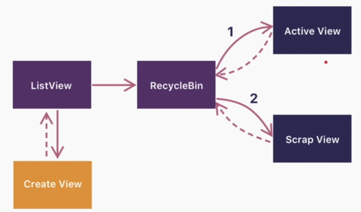
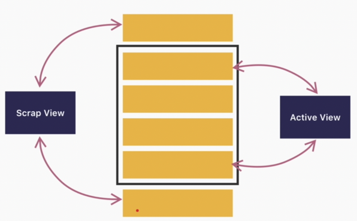
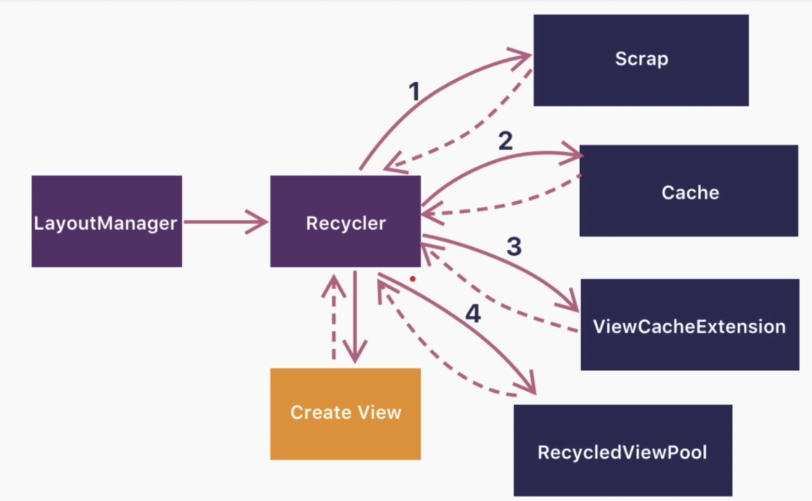
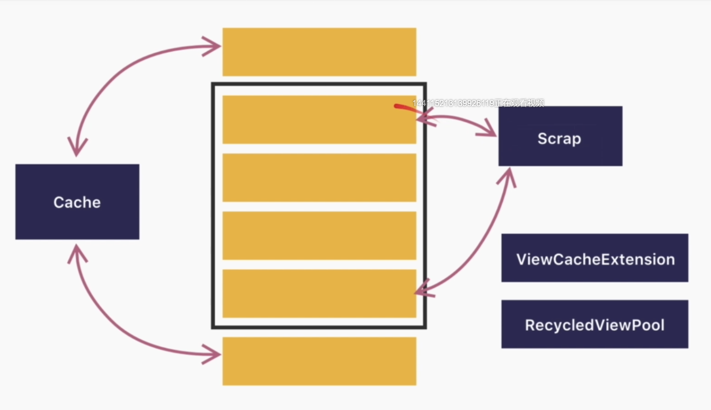
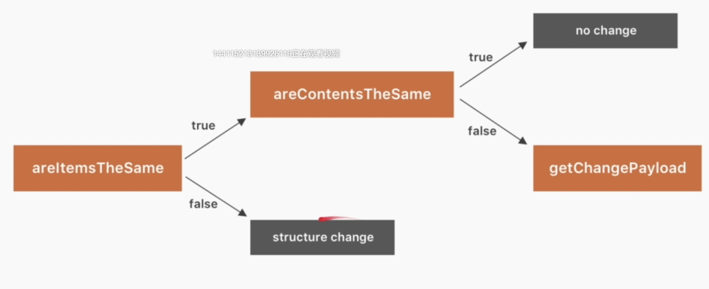

# RecyclerView性能优化

1. 支持linear、Grid、sttagerred Grid布局
2. 友好的 itemAnimation 动画api
3. 强制实现ViewHolder
4. 解耦的架构设计
5. 比listview更好的性能

涉及到四个重要类   RecyclerView   layoutManager   itemAnimator  adapter

ListView的问题

```java
public View getView±(int position, View convertView, ViewGrouop parent){
  ViewHolder holder;
  if(converView ==null){
    convertView = LayoutInflater.from(...);
    holder = new ViewHolder(convertView); //findViewById()  dfs过程
    converView.setTag(holder); // viewHolder和ItemView一一对应
  }else{
    holder = converView.getTag();
  }
  holder.bindTo(user); //只要屏幕中item有变动，就会触发绑定数据
  return converView;
}
```

RecyclerView数据绑定可以放到Viewholder里

```java
static  class ViewHolder extends RecyclerView.ViewHolder{
  TextView textView;
  ViewHolder(View itemView){
    super(itemView);
    textView = ...;
  }
  void bindTo(User user){
    ...
  }
}
```


## RecyclerView缓存原理


listView缓存，缓存itemView

结论  1. 凡是直接复用，不需要数据绑定的系统会跳过getView   2.凡是调用getView, 都需要重新绑定数据






RecylerView缓存 ，缓存ViewHolder, 其实就是缓存ItemView,  itemView和ViewHolder一一对应



从屏幕来看



scrap和cache直接根据position来找到并添加，不需要重新绑定数据（它们缓存了position, 缓存了itemView和对应的数据）。

ViewCacheExtension 用户自定义cache  TODO 自行查询

RecycledViewPool 数据都是dirty,  通过viewType找到对应数据，不走onCreateViewHolder, 但要走onbindView

## Item展示统计

listview可以直接在getitemView里统计

recyclerView不能在onBindView里统计，由于缓存机制，onBindView可能没有被调用，可以用viewholder的 onViewAttachedToWindow()


## 你可能不知道的RecyclerView性能优化策略

1. 在onbindViewHolder里调用setOnclickListener会导致重复创建listener 造成内存抖动，可以放到oncreatViewholder里，也可以设置一个全局的listener

2. LinearLayoutManager.setInitialPrefetchItemCount() （线性列表初次显示时可见的item个数），提升效率。

    用户滑到item recyclerView时需要创建子RecylerView，导致页面卡顿

    Android 5.0引入RenderThread, 把部分主线程工作放到RenderThread上UI渲染。主线程可以有空闲，RecyclerView会进行prefetch

   条件： linearLayoutManager有这个api  ; 只有嵌套在内部RecyclerView才会生效

3. RecylerView.setHasFixedSize（ture） , 使用生效的条件：如果数据的变化不会导致RecyclerView大小的变化

   ```java
   void onContentsChanged(){
     if(mHasFixedSize){
       layoutChildren();
     }else{
       requestLayout();
     }
   }
   ```

4. 多个RecyclerView共用RecycledViewPool，几个页面viewtype有重复。

   ```java
   RecyclerView.RecycledViewPool pool = new RecyclerView.RecycledViewPool();
   recycler1.setRecycledViewPool(pool);
   recycler2.setRecycledViewPool(pool);
   ```

5. DiffUtil

   notifyItemXXX()  不适用所有情况

   notifyDataSetChange() 会导致整个布局重绘

   DiffUtil适用于整个页面需要刷新，但有部分数据可能相同（动态规划，myers diff algorithm）  http://blog.robertelder.org/diff-algorithm/

   DiffUtil.calculateDiff 在item较多，数据比较复杂的情况下，需要考虑异步线程去做（Thread/Handler切线程， RxJava耗时放后台，google官封装AsyncListDiffer(Executor)/ListAdapter）

   ```java
   public abstract static class Callback {
       public abstract int getOldListSize();
       public abstract int getNewListSize();
       public abstract boolean areItemsTheSame(int oldItemPosition, int newItemPosition);
       public abstract boolean areContentsTheSame(int oldItemPosition, int newItemPosition);
       public Object getChangePayload(int oldItemPosition, int newItemPosition) {
           return null;
       }
   }
   
   //举例实现
   
   public class MyDiffUtils extends DiffUtil.Callback {
       private List<User> oldList;
       private List<User> newList;
   
       public MyDiffUtils(List<User> oldList, List<User> newList) {
           this.oldList = oldList;
           this.newList = newList;
       }
   
       @Override
       public int getOldListSize() {
           return oldList.size();
       }
   
       @Override
       public int getNewListSize() {
           return newList.size();
       }
   
       @Override
       public boolean areItemsTheSame(int oldItemPosition, int newItemPosition) {
           return oldList.get(oldItemPosition).gender == newList.get(newItemPosition).gender;
       }
   
       @Override
       public boolean areContentsTheSame(int oldItemPosition, int newItemPosition) {
           return oldList.get(oldItemPosition).gender == newList.get(newItemPosition).gender
                   && oldList.get(oldItemPosition).userId == newList.get(newItemPosition).userId
                   && oldList.get(oldItemPosition).name.equals(newList.get(newItemPosition));
       }
   
       @Nullable
       @Override
       public Object getChangePayload(int oldItemPosition, int newItemPosition) {
           User oldUser = oldList.get(oldItemPosition);
           User newUser = newList.get(newItemPosition);
           Bundle payload = new Bundle();
           if (oldUser.gender != newUser.gender) {
               payload.putInt("gender", newUser.gender);
           }
           if (oldUser.userId != newUser.userId) {
               payload.putInt("uid", newUser.userId);
           }
           if (!oldUser.name.equals(newUser.name)) {
               payload.putString("name", newUser.name);
           }
           if (payload.size() == 0) {
               return null;
           } else {
               return payload;
           }
       }
   }
   
   //与adapter结合使用
   
   public class MyAdapter extends RecyclerView.Adapter<MyAdapter.MViewHolder> {
       private List<User>mUserList;
   
       public MyAdapter(List<User> mUserList) {
           this.mUserList = mUserList;
       }
       
     //使用方法1
       public void flushData(List<User> newlist, boolean useDiff){
           if(useDiff){
               DiffUtil.DiffResult diffResult = DiffUtil.calculateDiff(new MyDiffUtils(mUserList, newlist), false);
               mUserList = newlist;
               diffResult.dispatchUpdatesTo(this);
           }else {
               mUserList = newlist;
               notifyDataSetChanged();
           }
       }
       ...
         
     //使用方法2
       @Override
       public void onBindViewHolder(@NonNull MViewHolder holder, int position, @NonNull List<Object> payloads) {
           if (payloads.isEmpty()) {
               onBindViewHolder(holder, position);
           } else {
               Bundle payload = (Bundle) payloads.get(0);
               for (String key : payload.keySet()) {
                   switch (key){
                       case "name":
                           holder.name.setText(payload.getString(key));
                           break;
                   }
               }
           }
           super.onBindViewHolder(holder, position, payloads);
       }
   }
    
   ```

   



